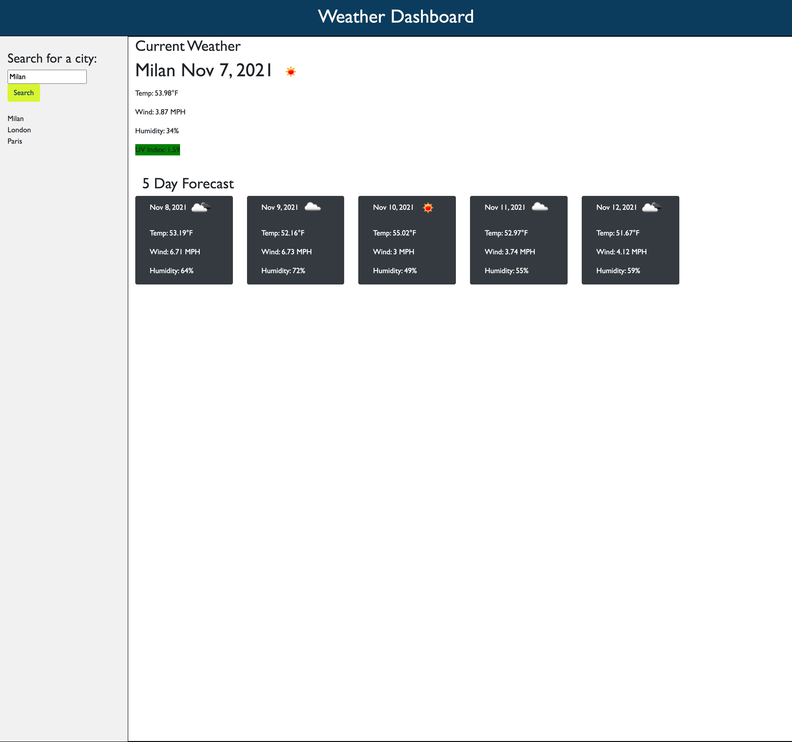

# weatherdashboard-serversideAPIs
View of current and future weather via API call to Open Weather

## Description
This application is designed for travelers who want to see the weather outlook for mutliple cities which will help them to better plan their trips.  

**features**
 * Abililty to enter city name to retreive the forecast
 * Current and future- 5 day forecasts are displayed
 * Critical details including temperature and a weather icon- for a quick glance
 * Also, key packing information like UV Index(sunscreen and sunglasses), wind speed (an extra jacket) and lastly humidity (bad hair- oh no!)
 * The app saves the citis you last looked at and you can click on those to see the weather to save typing
 * Weather data is obtained via API from Open Weather for both the weather information and the geo translation for latitude and longitude
 * Moment.js for date manipulations
 * Bootstrap is used for formatting of the application
 * Complete READme file
 

**future features**
 * Suggestions on best places to visit
 * Packing suggestions
 * Direct access to a map application to find the nearest place to visit

## Executing Program
If you would like to view , you can access full code and documentation by visiting Dawn LeBlanc's Git Hub Repo  https://github.com/dawnleblanc11/weatherdashboard-serversideAPIsor view directly via  https://dawnleblanc11.github.io/weatherdashboard-serversideAPIs/

## Help
All verification of usage was completed on a Google Chrome browser.

## Authors
Inital Code from Bootcamp
Revisions Dawn LeBlanc 11-2021

## Version History
1.0 Intital Commit
1.1 API Call set up
1.2 Switch to Farenheit
1.3 geo fetch for latitude and longitude
1.4 added moment for dates
1.5 all data captured
1.6 saving cities to local storage
1.7 clickable prior cities on load
1.8 remove duplicates before sending to storage
1.9 clean up fonts and readme

## License
N/A

## Acknowledgements
